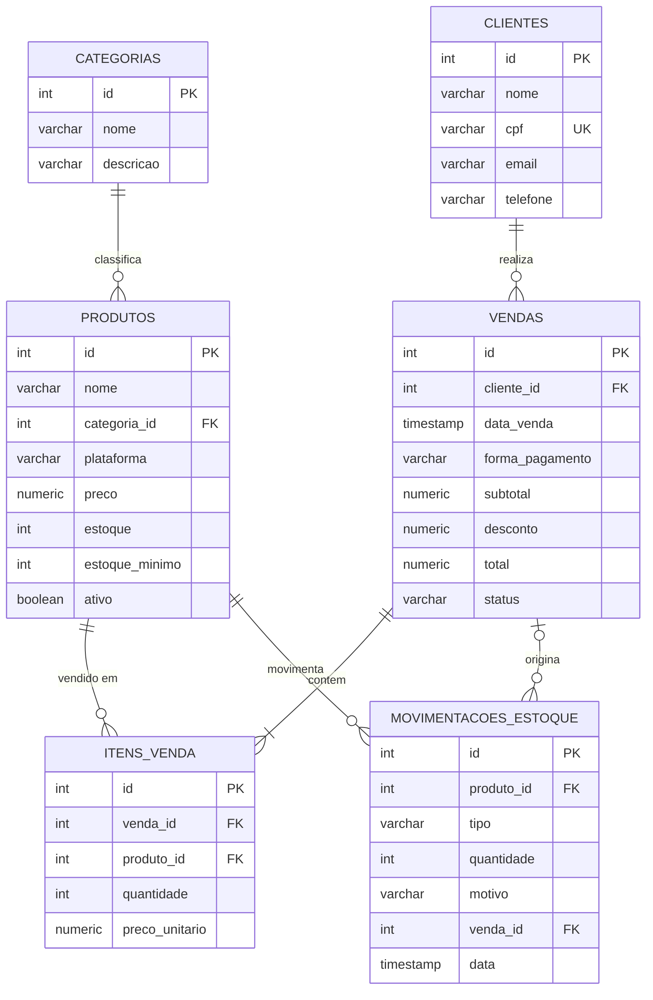

# Modelo de dados — ShopGame

## Recursos do banco x telas

| Recurso | Tipo | Tela que usa |
|---|---|---|
| `vw_relatorio_vendas` | View | Relatório de Vendas, Dashboard |
| `vw_produtos_estoque` | View | Produtos & Estoque, Nova Venda, Dashboard |
| `fn_nivel_cliente` | Function | Clientes, Nova Venda |
| `fn_calcular_desconto` | Function | Nova Venda (e dentro de `sp_realizar_venda`) |
| `sp_realizar_venda` | Procedure | Nova Venda → Finalizar venda |
| `sp_registrar_entrada_estoque` | Procedure | Produtos & Estoque → + Entrada / Novo produto |
| `sp_cancelar_venda` | Procedure | Relatório de Vendas → Cancelar |
